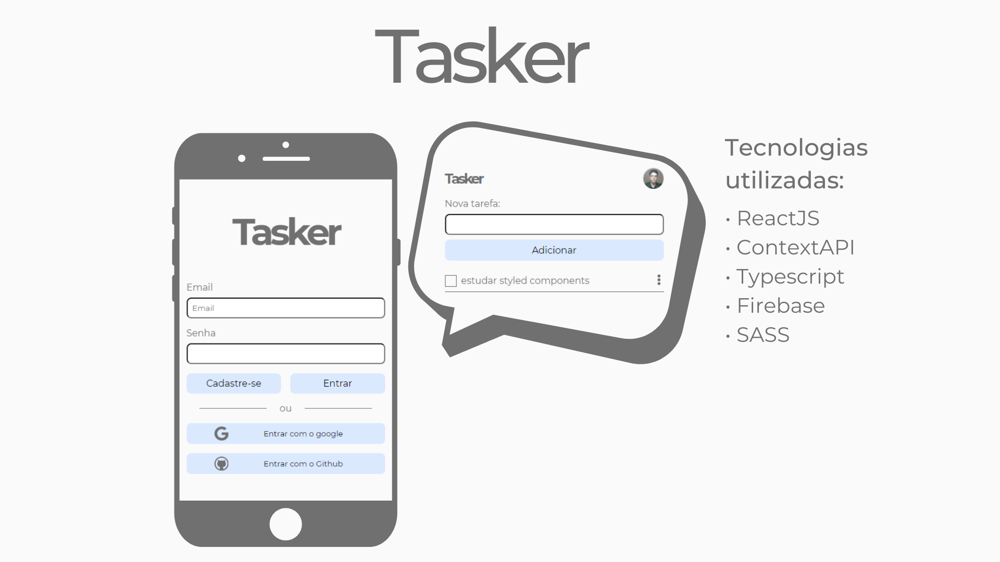

# Tasker


[Veja o app no firebase hosting](https://tasker-a9c89.web.app/)
### Descrição
Um app de To-Do list simples, utilizando o firebase para autenticação e firestore como banco de dados. 

## Tecnologias utilizadas
- ReactJs
- ContextApi
- React Hooks
- Typescript
- Firebase 
- SASS

### Como instalar (React)

* Para baixar o projeto siga as instruções abaixo:

```
1. git clone https://github.com/CaioVieira-dev/tasker.git
2. cd tasker
```

* Instale as dependências do projeto:

```
3. yarn install
4. yarn start
```

ou

```
3. npm install
4. npm start
```
### Importante
Para usar as funcionalidades do firebase você precisará de um projeto no firebase, e adicionar as variáveis do seu projeto no arquivo *"src/services/firebase.ts"*
## Me encontre nas redes sociais
- [Instagram: @caiovieira_dev](https://www.instagram.com/caiovieira_dev/)
- [LinkedIn: Caio Vieira](https://www.linkedin.com/in/caio-vieira-b1aab9201/)

## Licença
Este projeto pode ser usado por qualquer um. Licença MIT.


